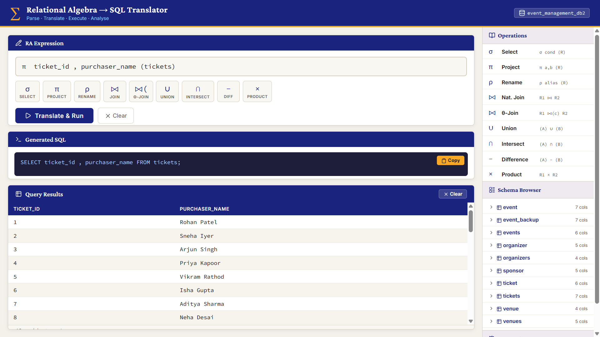

<div align="center">
  
  <h1>Relational Algebra to SQL Translator</h1>
  <p><i>A desktop application bridging theoretical database concepts with practical execution.</i></p>

 
</div>

---

##  Overview

The system translates complex Relational Algebra (RA) expressions into SQL, executes them against a local MySQL database, and displays the results in a clean, developer-focused interface. It utilizes a hybrid architecture that decouples parsing logic from the user interface. 

### Application Screenshot



---

##  Tech Stack


---

##  Key Features

* **Custom AST Parser:** A from-scratch C++17 parsing engine that constructs an Object-Oriented Abstract Syntax Tree for robust SQL translation.
* **Comprehensive Operator Support:** Handles Select, Project, Rename, Union, Difference, Intersection, Natural Join, Theta Join, and Cartesian Product.
* **Live Schema Introspection:** A sidebar schema browser that automatically fetches tables, columns, data types, and key constraints (PK/FK) from the connected MySQL database.
* **Secure Configuration:** Decoupled database credentials using environment variables (`.env`).
* **Developer-Focused UI:** Features a code editor theme, query history, and click-to-insert symbol panels utilizing crisp Lucide icons.

---

##  Architecture & Design

### System Architecture

The application relies on Inter-Process Communication (IPC) to pass data between the UI, the Node.js backend, the C++ execution layer, and the database.

<!-- PLACE ARCHITECTURE DIAGRAM HERE (e.g. ) -->
> *Flow: User Input -> Electron IPC -> C++ Subprocess -> Generated SQL -> MySQL Query -> JSON Results -> UI Render.*

### C++ Parser (Object-Oriented Design)

The backend parser avoids string manipulation in favor of a strong OOP hierarchy.

<!-- PLACE CLASS DIAGRAM HERE (e.g. ) -->
> *UML Class Diagram showing the `ASTNode` hierarchy (ProjectionNode, JoinNode, etc.) and the core `Parser` class.*

---

##  Supported Operations

| Operation | Symbol | Syntax Example | Generated SQL Mapping |
| :--- | :--- | :--- | :--- |
| **Selection** | `σ` | `σ condition (R)` | `WHERE` clause |
| **Projection** | `π` | `π a,b (R)` | `SELECT a,b` |
| **Rename** | `ρ` | `ρ alias (R)` | `AS alias` |
| **Natural Join** | `⨝` | `R1 ⨝ R2` | `NATURAL JOIN` |
| **Theta Join** | `⨝(cond)`| `R1 ⨝(c) R2` | `JOIN ... ON cond` |
| **Union** | `∪` | `(A) ∪ (B)` | `UNION` |
| **Intersection**| `∩` | `(A) ∩ (B)` | `INTERSECT` *(Requires MySQL 8.0.31+)* |
| **Difference** | `−` | `(A) - (B)` | `EXCEPT` *(Requires MySQL 8.0.31+)* |
| **Product** | `×` | `R1 × R2` | `CROSS JOIN` |

---

##  Installation & Setup

### Prerequisites
* **C++17 Compiler** (MinGW on Windows, GCC/Clang on Unix)
* **CMake** (v3.10+)
* **Node.js** (v16+)
* **MySQL** (v8.0+ recommended)

### 1. Build the C++ Translator

The parser must be compiled into an executable before running the app.

```bash
git clone https://github.com/mad-codes7/Mapping-Relational-Algebra.git
cd Mapping-Relational-Algebra/cpp-translator

# Create build directory
mkdir build
cd build

# Configure and compile
cmake -G "MinGW Makefiles" ..    # Use 'cmake ..' on macOS/Linux
cmake --build .
```

### 2. Configure Database Credentials

The Electron app requires access to your local MySQL database. Do not hardcode credentials.

```bash
cd ../../electron-gui

# Install Node dependencies
npm install

# Setup environment variables
cp .env.example .env
```

Open the `.env` file and input your local database details:
```env
DB_HOST=localhost
DB_USER=root
DB_PASSWORD="your_password_here"
DB_NAME=your_database_name
```
*Note: Ensure passwords with special characters (like `#`) are wrapped in double quotes.*

### 3. Run the Application

```bash
npm start
```


---

##  Contact

For queries, collaborations, or suggestions, feel free to reach out:
* **Email:** [madhurbiradar.dev@gmail.com](mailto:madhurbiradar.dev@gmail.com)
* **GitHub:** [mad-codes7](https://github.com/mad-codes7)

---

<div align="center">
  
  <p><b>Made for Database Lovers</b></p>
</div>
